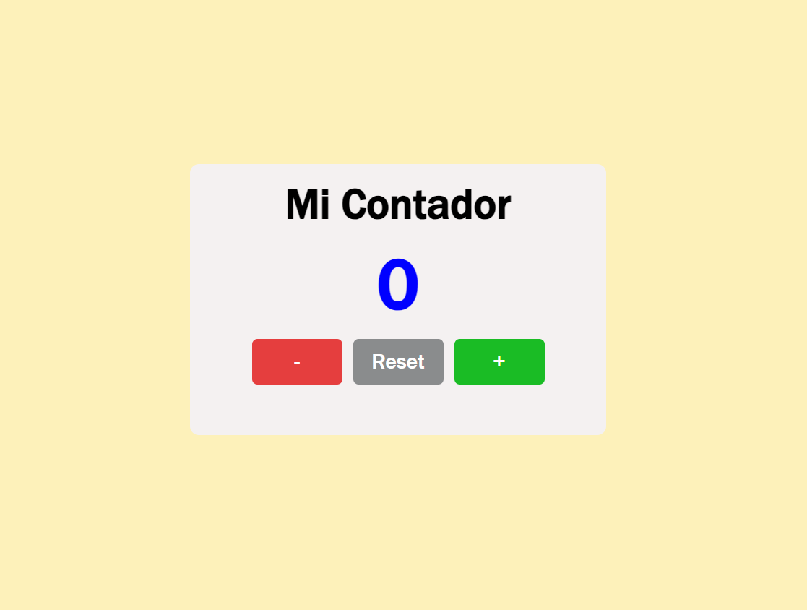

# 📟 Contador Básico

Este es un proyecto simple de un contador desarrollado con **HTML**, **CSS** y **JavaScript**. Ideal para principiantes que deseen practicar manipulación del DOM y eventos básicos en JavaScript.

## 🚀 Funcionalidades

- Incrementar el valor del contador
- Decrementar el valor del contador
- Reiniciar el contador
- Diseño responsive con CSS puro

## 🛠️ Tecnologías usadas

- HTML5
- CSS3
- JavaScript (Vanilla)

## 📂 Estructura del proyecto

